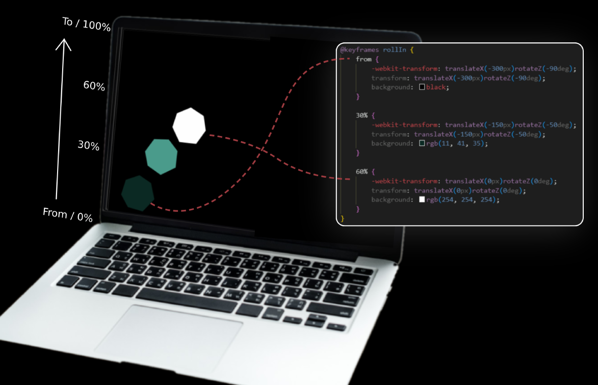

# keyframes To OnScroll

This script turns your keyframe animations into scroll-based animations **(see below for supported animations).**

Codepen: [keyframesToOnScroll (codepen.io)](https://codepen.io/aleids/pen/RwmQRpG)

Example website: [Aleidsuzan.com/animations](https://www.aleidsuzan.com/animations)

Made as an alternative to [animation-timeline:scroll](https://www.youtube.com/watch?v=UmzFk68Bwdk&ab_channel=KevinPowell), because that's not supported on all browsers yet as of June 2024. This script is not as extensive, but it should work on most browsers (tested on Chrome, Edge, Firefox, Opera, android, and mobile IOS).

#### How to:

Simply download the script.js file and add it to your website (safest option), or copy link below;

`` 

It will go through all the rules in your stylesheets and read out the animations, then turn them into scroll-based ones.

**Also add Jquery:**

``

**In your keyframe style rules:**

* 0% (or 'from') means div is at the bottom of the screen
* 100% (or 'to') means div is at the top of the screen:

- Interprolates styles in between your defined keyframe percentages when scrolling between them.
- If you want your animation to end at e.g. halfway the screen, use 50% as your last keyframe value.
- Elements will take on first animation frame when entering the screen, and retain the last untill exiting.
- Does **not consider inline CSS animations**
- **Number of stylesheets:** If you only want to include the first stylesheet, refer to line 27- 46 and comment out this block of code.
- If you want to **exclude an animation**, include 'exclude' in the animation name (Case sensitive), it will then ignore this animation.

#### Currently works for:

* **Simple css properties** that have a (value)(unit) notation, like width:3px, height: 3vh; or e.g. left, right, margins, paddings, opacity etc. **Needs to have the same units in all frames.**
* **simple transformations** with value/unit notation (it will split the transformation into parts if needed) like transformX(20px)rotateY(30deg), but not skew(30deg, 20deg)
* **simple filters and backdrop filters** that use (value)(unit) notations, like blur(2px), but not drop-shadow or url-based filters. Will split into prats like transformations
* **background-color, background, color, border-color** (uses HSL based color-mix function) for background, this only works with a color. Can use rgb, hsl, color names, whichever you prefer.
* Most clip-paths
* most box-shadows

**Not working yet:** Complex CSS properties like background-images or anything not mentioned above

If an element has 2 animations (e.g. one for DIV and one for .Classname) rather than overriding, it will run both of them, and might cause clashes.

### Technical info

- It will set the animation-duration of targeted elements to 0s, iteration count to 1, fill-mode to none and direction to normal to disable the default keyframe animations. Also adds a transition of 0.5s to prevent glitches.

I made this script for someone scrolling down the document, and scrolling up is a little less accurate (would need to change some formulas)
